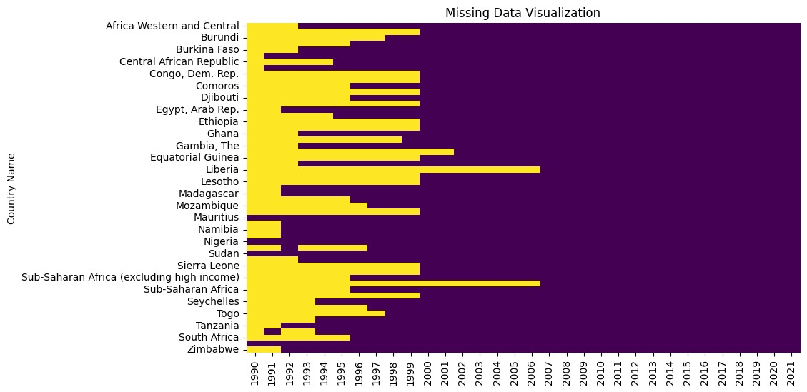
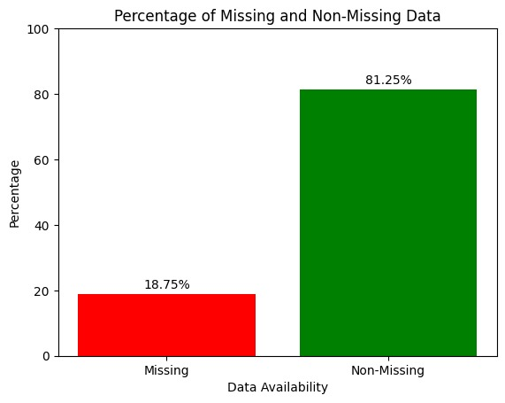
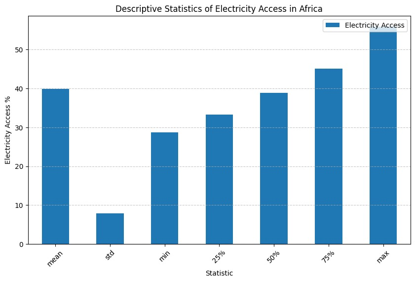
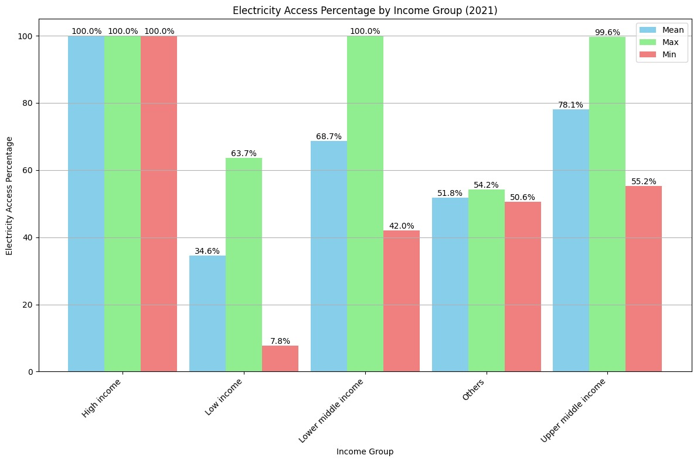
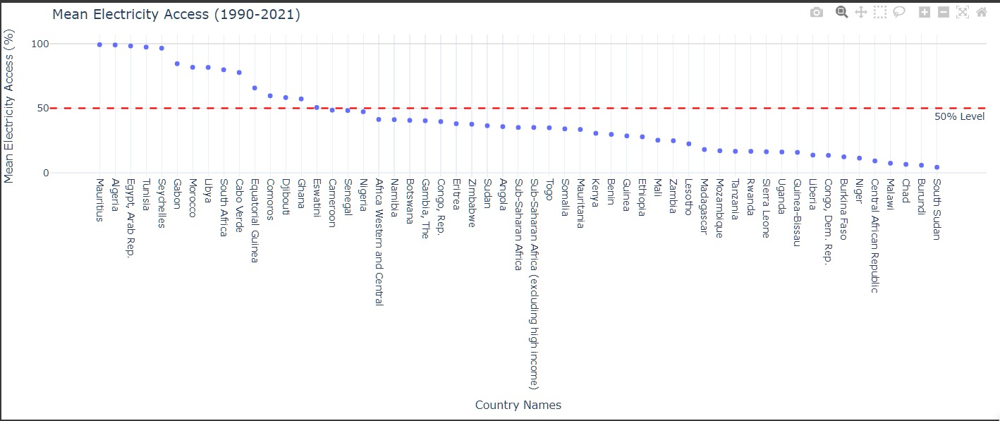
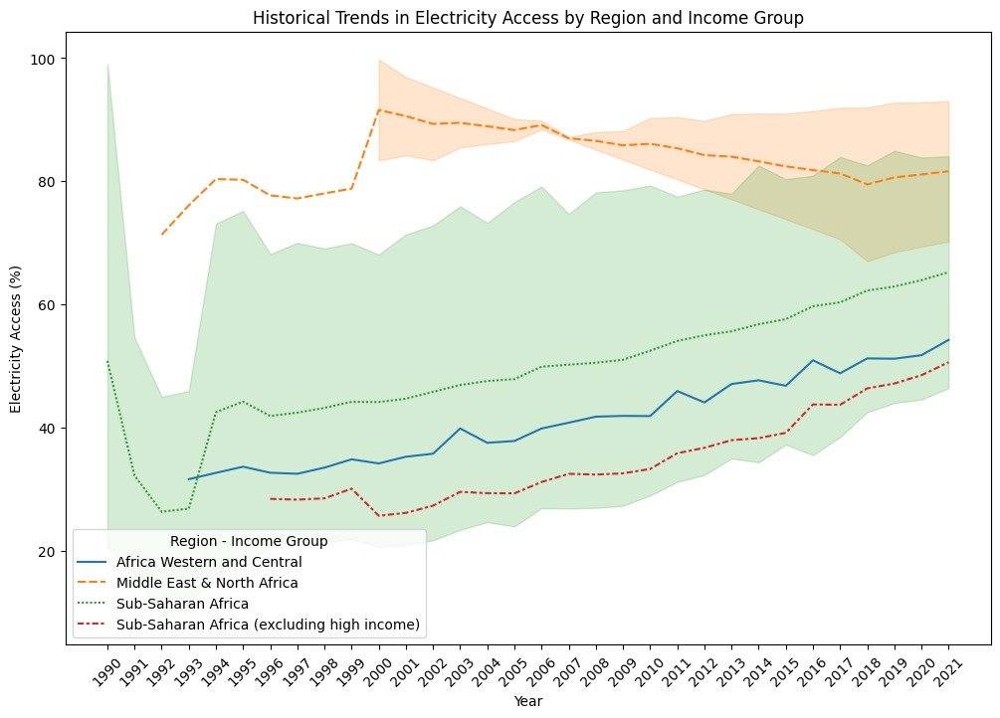

# Predictive-Modeling-of-Electricity-Access-in-Africa

## Project Overview
Access to electricity is vital for economic development and societal well-being. Nations with reliable
electricity tend to exhibit higher productivity, an improved standard of living, and enhanced
competitiveness in the global market. Electricity plays a crucial role across various sectors, including
agriculture, education, and healthcare, ensuring their efficient operations. This research endeavours to
analyze data from 1990 to 2021 to discern patterns and trends in electricity access across African countries.
Leveraging regional and income data, alongside predictive modelling techniques, our goal is to offer
insights that can guide policy decisions and interventions aimed at understanding electricity access in the
region.

According to data analysis and projections from the International Energy Agency (IEA), approximately 110
million new connections are required annually starting in 2022. However, given the current pace observed
in recent years, this target remains significantly off track (IEA, 2023). (https://www.iea.org/reports/sdg7-
data-and-projections). The idea of this project is to analyze and track the trend of electricity access in Africa
and attempt to develop predictive modelling of electricity access in Africa to identify significant statistical
relationships and differences through the forecast and trends.

## Problem Statement

The problem that this study addresses revolves around the persistent challenge of low electricity access in 
various African countries.
If this issue remains unaddressed, it could have severe consequences, impacting millions of people and 
impeding socio-economic development in these countries. The lack of electricity access hinders progress 
towards achieving the United Nations' Sustainable Development Goals (SDGs) of promoting inclusive and 
sustainable economic growth.
To effectively tackle this challenge, robust forecasting techniques like the ARIMA model need to be utilized 
to project electricity access levels until 2030. This approach aligns with the recommendations of scholars 
like Ma et al. (2019), who advocate for extended-duration forecasting models to address the complexities of 
energy access planning in African countries.

## Objectives:
    
   + Analyze historical trends in electricity access across African countries relative to region and
income.

   + Identify similarities, differences, and patterns in electricity access among African countries.
    
   + Develop predictive models to forecast future electricity access levels based on regional and
income data.

   + Provide valuable analysis to inform targeted interventions for understanding electricity access
in Africa.

# Methodology

## Research and Data Collection
   Datasets: The data for this project was gotten from the World Bank data on Access to electricity - https://data.worldbank.org/indicator/EG.ELC.ACCS.ZS

## Data Pre-processing

Data preprocessing was done on the data to clean and transform the data for analysis.

  + Data Cleaning: Identifying the extent of missing values and outliers in the dataset. 

+ Data Availability
  

## Exploratory Data Analysis

 + Descriptive Statistics

  + Electricity Access Percentage by Income Group

    

## Trend Analysis of Electricity Access in Africa 
 + Electricity Access by Income Group
   

  + Historical Trends in Electricity Access by Region and Income Group

# Historical Trends Analysis 

Analyzing the trends in electricity access across different regions and income groups in Africa, we can observe a dynamic yet challenging landscape. The line graph above depicts electricity access spanning  1990 to 2021. It is a visual representation of the progress and disparities in electrification in Africa.

Africa Western and Central (green solid line) shows a commendable steady increase in electricity access. This suggests that initiatives and investments in infrastructure have begun to pay off in that region, although the starting point was quite low. The consistent upward trajectory indicates that more households (percentage of population) are experiencing the benefits of electricity access which can lead to improved quality of life and economic development.

Middle East & North Africa*(red dashed line), with a higher initial electricity access, continues to improve, albeit at a slower rate. This could be due to already having a relatively developed electrical grid, thus the marginal gains appear less dramatic compared to regions starting from a lower baseline.

*Sub-Saharan Africa (excluding high income) (blue dotted line) depicts a consistent rise in electricity access. However, it's evident that the overall levels of access are lower compared to the other regions. This highlights the ongoing struggle to provide electricity to all, especially in rural areas where the infrastructure may be lacking or non-existent.

The shaded areas between the lines suggest that there are overlaps in electricity access percentages among these groups, indicating that no single narrative can fully capture the diverse experiences of electrification across Africa.

However, while there is a clear overall trend of increasing electricity access in Africa, the pace and extent of progress vary widely. The data underscores the need for continued efforts to bridge the electrification gap, particularly in regions that are lagging behind. It also emphasizes the importance of tailored solutions that consider the unique challenges and opportunities within each region and income group. The goal remains to achieve universal electricity access, which is essential for social and economic development.

The data analysis, also reveals that there is a strong connection between electricity access and income group. Regions with high income tend to have higher percentage of electricity access.
(see figure 4 below)

fix visuals side by side here

# Electricity Access: Income Group vs Region

    

  + Income Group Distribution by Region
    

## Predictive Modeling

## Results and Discussion

## Code Repository Structure

## Installation and Usage

